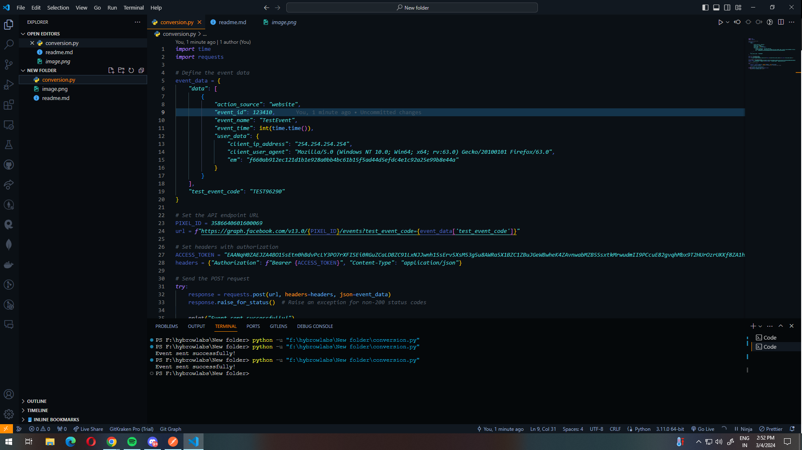
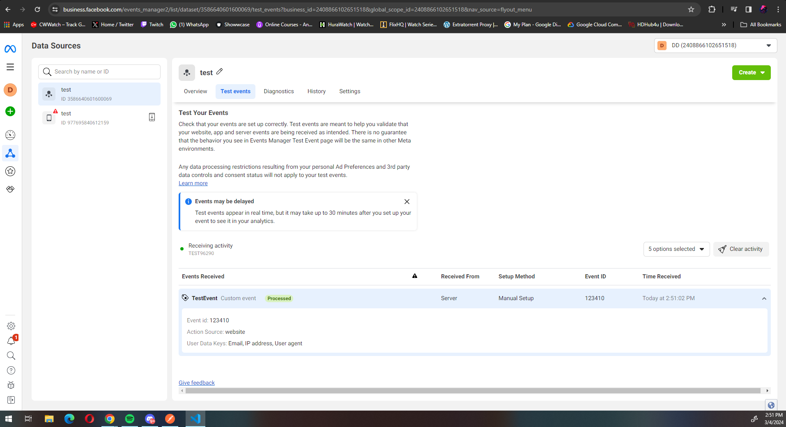

## the json data which was sent 


## The data what was sent 


## Sending Events to Facebook Pixel API

This Python script allows you to send events to the Facebook Pixel API. Follow the steps below to set up and use the script.

### Prerequisites

1. **Python Installation**: Make sure you have Python installed on your system. You can download and install Python from the [official Python website](https://www.python.org/downloads/).

2. **Required Python Libraries**: You need to have the `requests` library installed. If you haven't installed it yet, you can install it via pip:

   ```bash
   pip install requests
   ```

### Getting Started

1. **Facebook Pixel Setup**:

   - Make sure you have a Facebook Pixel created on your Facebook Business account.
   - Obtain your Pixel ID and Access Token from the Facebook Events Manager.

2. **Update Script with Your Information**:

   - Open the provided Python script (`send_facebook_event.py`) in a text editor.
   - Replace the placeholders with your actual Pixel ID and Access Token:
     ```python
     PIXEL_ID = Your_Pixel_ID
     ACCESS_TOKEN = "Your_Access_Token"
     ```
   - You can also customize the event details such as `EVENT_NAME`, `TEST_DATA1`, `TEST_DATA2`, etc. as per your requirements.

3. **Run the Script**:

   - Open a terminal or command prompt.
   - Navigate to the directory containing the script.
   - Run the script using Python:
     ```bash
     python send_facebook_event.py
     ```

4. **Verify Event Submission**:

   - If the event submission is successful, you'll see the message "Event sent successfully!".
   - If there's an error, you'll see an error message indicating the issue.

### Optional: Hashing User Data

If you want to hash user data before sending it to Facebook (for privacy reasons), you can uncomment and use the `hash_user_data` function in the script. Follow these additional steps:

1. Uncomment the `hash_user_data` function in the script.
2. Replace `USER_DATA` with the hashed data:
   ```python
   USER_DATA = hash_user_data(USER_DATA)
   ```

### Additional Notes

- **Event Timestamp**: The script generates a unique event ID using the current timestamp. You can customize this behavior if needed.
- **API Version**: The script uses Facebook Graph API version 13.0. You can update the version if needed.
- **Error Handling**: The script includes error handling to catch any exceptions during the event submission process.

---

### Prerequisites

1. **Python Installation**: Make sure you have Python installed on your system. You can download and install Python from the [official Python website](https://www.python.org/downloads/).

2. **Required Python Libraries**: You need to have the `requests` library installed. This library is used to make HTTP requests to the Facebook Pixel API. If you haven't installed it yet, you can install it via pip:

   ```bash
   pip install requests
   ```

   The `requests` library simplifies the process of making HTTP requests in Python. It provides an easy-to-use interface for sending HTTP requests and handling responses.

### What `requests` Library Does

The `requests` library allows the Python script to communicate with the Facebook Pixel API over HTTP. Here's what it does:

- **Sends HTTP Requests**: The library enables the script to send POST requests to the Facebook Pixel API endpoint (`https://graph.facebook.com/v13.0/{PIXEL_ID}/events`) to submit events.
- **Handles HTTP Responses**: After sending a request, the library handles the response from the Facebook Pixel API. It checks for any errors or status codes that indicate success or failure.
- **Simplifies Request Building**: With `requests`, you can construct HTTP requests with ease. The library provides simple methods and parameters for adding headers, setting request data, and specifying the request method.

By using the `requests` library, the Python script can interact with the Facebook Pixel API seamlessly, making it easy to send events and handle responses.

---

### Prerequisites

1. **Python Installation**: Make sure you have Python installed on your system. You can download and install Python from the [official Python website](https://www.python.org/downloads/).

2. **Required Python Libraries**: You need to have the `hashlib` library installed. This library is used for hashing user data before sending it to the Facebook Pixel API. Fortunately, `hashlib` is a built-in Python library, so you don't need to install it separately.

### What `hashlib` Library Does

The `hashlib` library provides a common interface to many secure hash and message digest algorithms, including SHA-256, which is commonly used for hashing data. Here's what it does:

- **Hashing User Data**: The library enables the script to hash sensitive user data before sending it to the Facebook Pixel API. Hashing is a one-way cryptographic function that transforms input data into a fixed-size string of bytes. This process helps protect user privacy by anonymizing sensitive information such as IP addresses and user agents.

- **Secure Hashing Algorithms**: `hashlib` supports various secure hashing algorithms, including SHA-256, SHA-1, MD5, and more. In this script, SHA-256 is used to hash user data.

By using the `hashlib` library, the Python script can hash user data securely before sending it to the Facebook Pixel API, ensuring the privacy and security of user information.
